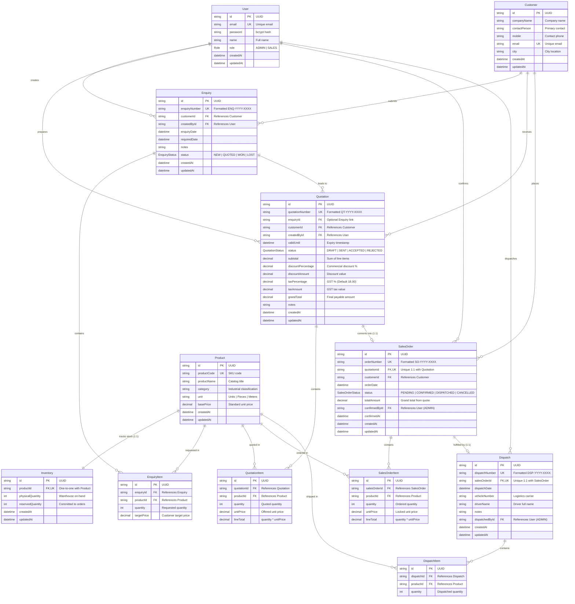

# Database Schema and Entity-Relationship (ER) Documentation

This document describes the complete relational database design, data dictionary, integrity constraints, and concurrency locking mechanisms for the Industrial B2B Manufacturing and Supply Chain ERP.

---

## 1. Entity-Relationship (ER) Diagram

---

## 2. Enumerated Types (Enums)

### Role
Defines the authorization tier in the system:
- `ADMIN`: Full access to inventory adjustments, order confirmation, inventory locking, dispatch execution, quotation management, and system audits.
- `SALES`: Operational commercial access to customer onboarding, RFQ enquiries, quotation preparation, and dispatch status review.

### EnquiryStatus
Lifecycle states of an inbound customer enquiry:
- `NEW`: Ingested RFQ enquiry awaiting commercial evaluation.
- `QUOTED`: Commercial quotation drafted and issued to customer.
- `WON`: Quotation accepted and converted to order.
- `LOST`: Customer rejected quotation or lead went cold.

### QuotationStatus
Lifecycle states of a commercial quotation:
- `DRAFT`: Editable internal draft. Cannot be converted to Sales Order.
- `SENT`: Formally dispatched to customer with locked terms and validity deadline.
- `ACCEPTED`: Customer accepted pricing and terms. Eligible for conversion to Sales Order.
- `REJECTED`: Commercial terms declined or negotiation expired.

### SalesOrderStatus
Lifecycle states of a confirmed sales order:
- `PENDING`: Converted from an accepted quotation. Inventory has not yet been reserved.
- `CONFIRMED`: Admin confirmed order. Row-level locks secured, and stock reserved in `Inventory.reservedQuantity`.
- `DISPATCHED`: Stock picked, packed, and physically deducted from inventory. Logistics tracking recorded.
- `CANCELLED`: Admin cancelled order. Any reserved stock is released back to available inventory.

---

## 3. Data Dictionary and Table Schemas

### Table: `User`
Stores system accounts for role-based authentication and operational audit trails.

| Column | Type | Nullable | Constraints | Description |
|---|---|---|---|---|
| `id` | VARCHAR(36) | No | PRIMARY KEY, UUID | Unique user identifier |
| `email` | VARCHAR(255) | No | UNIQUE, INDEX | Corporate email address |
| `password` | VARCHAR(255) | No | | bcrypt hash with salt rounds |
| `name` | VARCHAR(100) | No | | Full employee name |
| `role` | Role | No | DEFAULT 'SALES' | System authorization role |
| `createdAt` | TIMESTAMP | No | DEFAULT NOW() | Record creation timestamp |
| `updatedAt` | TIMESTAMP | No | AUTO UPDATE | Last update timestamp |

---

### Table: `Customer`
Master directory of B2B client organizations and procurement contacts.

| Column | Type | Nullable | Constraints | Description |
|---|---|---|---|---|
| `id` | VARCHAR(36) | No | PRIMARY KEY, UUID | Unique customer identifier |
| `companyName` | VARCHAR(150) | No | INDEX | Registered legal corporate name |
| `contactPerson` | VARCHAR(100) | No | | Designated procurement officer |
| `mobile` | VARCHAR(20) | No | | Contact phone number |
| `email` | VARCHAR(255) | No | UNIQUE, INDEX | Official customer billing email |
| `city` | VARCHAR(100) | No | | Operational city / shipping region |
| `createdAt` | TIMESTAMP | No | DEFAULT NOW() | Ingestion timestamp |
| `updatedAt` | TIMESTAMP | No | AUTO UPDATE | Last update timestamp |

---

### Table: `Product`
Master catalog of industrial equipment, electrical machines, and mechanical components.

| Column | Type | Nullable | Constraints | Description |
|---|---|---|---|---|
| `id` | VARCHAR(36) | No | PRIMARY KEY, UUID | Unique product identifier |
| `productCode` | VARCHAR(50) | No | UNIQUE, INDEX | Industrial SKU code (e.g., `IND-MOT-001`) |
| `productName` | VARCHAR(200) | No | | Descriptive product name |
| `category` | VARCHAR(100) | No | INDEX | Classification (Motors, Pumps, Valves) |
| `unit` | VARCHAR(30) | No | | Unit of measurement (Units, Pieces, Meters) |
| `basePrice` | DECIMAL(12,2) | No | | Standard catalog unit price before tax |
| `createdAt` | TIMESTAMP | No | DEFAULT NOW() | Catalog entry timestamp |
| `updatedAt` | TIMESTAMP | No | AUTO UPDATE | Last update timestamp |

---

### Table: `Inventory`
Maintains physical on-hand quantities and active order reservations. Has a strict 1-to-1 relationship with `Product`.

| Column | Type | Nullable | Constraints | Description |
|---|---|---|---|---|
| `id` | VARCHAR(36) | No | PRIMARY KEY, UUID | Unique inventory record identifier |
| `productId` | VARCHAR(36) | No | UNIQUE, FK -> Product.id | Cascade delete on product removal |
| `physicalQuantity` | INTEGER | No | DEFAULT 0 | Actual physical stock in warehouse |
| `reservedQuantity` | INTEGER | No | DEFAULT 0 | Stock allocated to confirmed orders |
| `createdAt` | TIMESTAMP | No | DEFAULT NOW() | Initialization timestamp |
| `updatedAt` | TIMESTAMP | No | AUTO UPDATE | Last update timestamp |

> **Virtual Property Formula:**
> `Available Stock = physicalQuantity - reservedQuantity`
> A product cannot be confirmed for dispatch if `requestedQuantity > Available Stock`.

---

### Table: `Enquiry`
Represents customer Requests for Quotation (RFQ).

| Column | Type | Nullable | Constraints | Description |
|---|---|---|---|---|
| `id` | VARCHAR(36) | No | PRIMARY KEY, UUID | Unique enquiry identifier |
| `enquiryNumber` | VARCHAR(50) | No | UNIQUE, INDEX | Formatted identifier (e.g., `ENQ-2026-0001`) |
| `customerId` | VARCHAR(36) | No | FK -> Customer.id, INDEX | Inquiring customer |
| `createdById` | VARCHAR(36) | No | FK -> User.id | Sales representative owner |
| `enquiryDate` | TIMESTAMP | No | DEFAULT NOW() | Submission timestamp |
| `requiredDate` | TIMESTAMP | Yes | | Customer delivery target |
| `notes` | TEXT | Yes | | Technical specifications or remarks |
| `status` | EnquiryStatus | No | DEFAULT 'NEW', INDEX | Current RFQ lifecycle status |
| `createdAt` | TIMESTAMP | No | DEFAULT NOW() | Creation timestamp |
| `updatedAt` | TIMESTAMP | No | AUTO UPDATE | Last update timestamp |

---

### Table: `EnquiryItem`
Line items associated with a customer enquiry.

| Column | Type | Nullable | Constraints | Description |
|---|---|---|---|---|
| `id` | VARCHAR(36) | No | PRIMARY KEY, UUID | Unique line item identifier |
| `enquiryId` | VARCHAR(36) | No | FK -> Enquiry.id, INDEX | Cascade delete on enquiry removal |
| `productId` | VARCHAR(36) | No | FK -> Product.id, INDEX | Inquired catalog product |
| `quantity` | INTEGER | No | CHECK (quantity > 0) | Quantity requested |
| `targetPrice` | DECIMAL(12,2) | Yes | | Customer budget target per unit |

---

### Table: `Quotation`
Commercial proposal generated with server-side price calculations, discounts, and GST.

| Column | Type | Nullable | Constraints | Description |
|---|---|---|---|---|
| `id` | VARCHAR(36) | No | PRIMARY KEY, UUID | Unique quotation identifier |
| `quotationNumber` | VARCHAR(50) | No | UNIQUE, INDEX | Formatted identifier (e.g., `QT-2026-0001`) |
| `enquiryId` | VARCHAR(36) | Yes | FK -> Enquiry.id | Optional parent RFQ reference |
| `customerId` | VARCHAR(36) | No | FK -> Customer.id, INDEX | Recipient customer |
| `createdById` | VARCHAR(36) | No | FK -> User.id | Authoring sales engineer |
| `validUntil` | TIMESTAMP | No | | Commercial quote expiration date |
| `status` | QuotationStatus | No | DEFAULT 'DRAFT', INDEX | Commercial review status |
| `subtotal` | DECIMAL(12,2) | No | | Sum of all line item totals |
| `discountPercentage` | DECIMAL(5,2) | No | DEFAULT 0.00 | Negotiated commercial discount % |
| `discountAmount` | DECIMAL(12,2) | No | DEFAULT 0.00 | Computed discount value |
| `taxPercentage` | DECIMAL(5,2) | No | DEFAULT 18.00 | Statutory GST rate % |
| `taxAmount` | DECIMAL(12,2) | No | DEFAULT 0.00 | Computed statutory tax |
| `grandTotal` | DECIMAL(12,2) | No | | Subtotal - Discount + Tax |
| `notes` | TEXT | Yes | | Payment and warranty terms |
| `createdAt` | TIMESTAMP | No | DEFAULT NOW() | Issuance timestamp |
| `updatedAt` | TIMESTAMP | No | AUTO UPDATE | Last update timestamp |

---

### Table: `QuotationItem`
Line items in a formal commercial quotation.

| Column | Type | Nullable | Constraints | Description |
|---|---|---|---|---|
| `id` | VARCHAR(36) | No | PRIMARY KEY, UUID | Unique quotation line identifier |
| `quotationId` | VARCHAR(36) | No | FK -> Quotation.id, INDEX | Cascade delete on quotation removal |
| `productId` | VARCHAR(36) | No | FK -> Product.id, INDEX | Quoted catalog item |
| `quantity` | INTEGER | No | CHECK (quantity > 0) | Quoted quantity |
| `unitPrice` | DECIMAL(12,2) | No | | Offered unit price |
| `lineTotal` | DECIMAL(12,2) | No | | Computed (quantity * unitPrice) |

---

### Table: `SalesOrder`
Contractual commitment created strictly from an `ACCEPTED` quotation.

| Column | Type | Nullable | Constraints | Description |
|---|---|---|---|---|
| `id` | VARCHAR(36) | No | PRIMARY KEY, UUID | Unique sales order identifier |
| `orderNumber` | VARCHAR(50) | No | UNIQUE, INDEX | Formatted identifier (e.g., `SO-2026-0001`) |
| `quotationId` | VARCHAR(36) | No | UNIQUE, FK -> Quotation.id | Strict 1-to-1: Prevents double ordering |
| `customerId` | VARCHAR(36) | No | FK -> Customer.id, INDEX | Ordering customer |
| `orderDate` | TIMESTAMP | No | DEFAULT NOW() | Order booking timestamp |
| `status` | SalesOrderStatus | No | DEFAULT 'PENDING', INDEX | Order processing state |
| `totalAmount` | DECIMAL(12,2) | No | | Grand total locked from quotation |
| `confirmedById` | VARCHAR(36) | Yes | FK -> User.id | Administrator who approved reservation |
| `confirmedAt` | TIMESTAMP | Yes | | Stock reservation timestamp |
| `createdAt` | TIMESTAMP | No | DEFAULT NOW() | Order generation timestamp |
| `updatedAt` | TIMESTAMP | No | AUTO UPDATE | Last update timestamp |

---

### Table: `SalesOrderItem`
Snapshot of line items locked into the sales order contract.

| Column | Type | Nullable | Constraints | Description |
|---|---|---|---|---|
| `id` | VARCHAR(36) | No | PRIMARY KEY, UUID | Unique sales order line identifier |
| `salesOrderId` | VARCHAR(36) | No | FK -> SalesOrder.id, INDEX | Cascade delete on order removal |
| `productId` | VARCHAR(36) | No | FK -> Product.id, INDEX | Ordered product item |
| `quantity` | INTEGER | No | CHECK (quantity > 0) | Quantity to reserve and deliver |
| `unitPrice` | DECIMAL(12,2) | No | | Unit price locked from quote |
| `lineTotal` | DECIMAL(12,2) | No | | Computed line total |

---

### Table: `Dispatch`
Logistics and fulfillment record for warehouse shipping.

| Column | Type | Nullable | Constraints | Description |
|---|---|---|---|---|
| `id` | VARCHAR(36) | No | PRIMARY KEY, UUID | Unique dispatch identifier |
| `dispatchNumber` | VARCHAR(50) | No | UNIQUE, INDEX | Formatted identifier (e.g., `DSP-2026-0001`) |
| `salesOrderId` | VARCHAR(36) | No | UNIQUE, FK -> SalesOrder.id | Strict 1-to-1: Prevents double dispatch |
| `dispatchDate` | TIMESTAMP | No | DEFAULT NOW() | Warehouse dispatch timestamp |
| `vehicleNumber` | VARCHAR(50) | No | | Logistics vehicle registration |
| `driverName` | VARCHAR(100) | No | | Transporter driver name |
| `notes` | TEXT | Yes | | Consignment notes and gate pass details |
| `dispatchedById` | VARCHAR(36) | No | FK -> User.id | Warehouse manager or Admin |
| `createdAt` | TIMESTAMP | No | DEFAULT NOW() | Dispatch logging timestamp |
| `updatedAt` | TIMESTAMP | No | AUTO UPDATE | Last update timestamp |

---

### Table: `DispatchItem`
Physical items verified and packed into the dispatch vehicle.

| Column | Type | Nullable | Constraints | Description |
|---|---|---|---|---|
| `id` | VARCHAR(36) | No | PRIMARY KEY, UUID | Unique dispatch line identifier |
| `dispatchId` | VARCHAR(36) | No | FK -> Dispatch.id, INDEX | Cascade delete on dispatch removal |
| `productId` | VARCHAR(36) | No | FK -> Product.id, INDEX | Dispatched catalog product |
| `quantity` | INTEGER | No | CHECK (quantity > 0) | Quantity loaded onto carrier |

---

## 4. Key Relational and Architectural Integrity Rules

1. **One-to-One Product-Inventory Enforcement:**
   Every physical `Product` has exactly one `Inventory` row (`productId` has a `UNIQUE` constraint). Deleting a product automatically cascades and purges its inventory record.

2. **Single-Quote-to-Single-Order Guarantee:**
   `SalesOrder.quotationId` has a `UNIQUE` database constraint. It is impossible at the database level for a single quotation to generate multiple sales orders, protecting against duplicate order processing.

3. **Single-Order-to-Single-Dispatch Guarantee:**
   `Dispatch.salesOrderId` has a `UNIQUE` database constraint. A confirmed sales order cannot be dispatched more than once.

4. **Financial Consistency:**
   All monetary fields (`basePrice`, `subtotal`, `discountAmount`, `taxAmount`, `grandTotal`, `unitPrice`, `lineTotal`) use `DECIMAL(12, 2)` to eliminate floating-point rounding errors.

5. **Concurrency-Safe Stock Reservation (`SELECT ... FOR UPDATE`):**
   When an admin confirms a sales order, the system starts a PostgreSQL database transaction:
   - Queries the inventory row using `SELECT ... FROM "Inventory" WHERE "productId" = $1 FOR UPDATE`.
   - Checks: `(physicalQuantity - reservedQuantity) >= orderQuantity`.
   - If sufficient, updates: `reservedQuantity = reservedQuantity + orderQuantity`.
   - If insufficient, rolls back the entire transaction and returns HTTP `409 Conflict`.
   - On physical dispatch: Decrements both `physicalQuantity` and `reservedQuantity` simultaneously.
